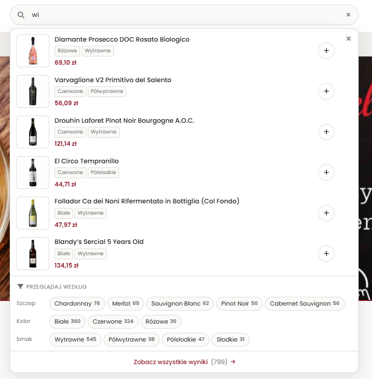

<p align="center">
  
</p>

<p align="center">
  <em>"You see, in this world, there's two kinds of people, my friend: those with loaded guns and those who dig. You dig"</em><br />
  - Clint Eastwood, <em>The Good, The Bad, and The Ugly</em>
</p>

# Procyon Dig Engine

High-performance WooCommerce product search powered by dedicated FULLTEXT and taxonomy index tables.

## What This Plugin Does

- builds a searchable product index (title, excerpt, content, SKU, term names),
- stores product-to-term mappings (`taxonomy + term_id`) for filters/facets,
- exposes REST API endpoints for search and status,
- provides WP-CLI commands for status and full reindex,
- keeps the index updated automatically when products change.

## Requirements

- WordPress with WooCommerce active,
- PHP 7.4+,
- MySQL/MariaDB with InnoDB FULLTEXT support,
- WP-CLI for `procyon dig` commands.

## Quick Start

1. Activate the plugin.
2. Configure plugin in **Settings -> Procyon Dig Engine**:

- searchable fields (title/excerpt/content/SKU/term names),
- additional custom product taxonomies to index,
- optional WooCommerce search replacement toggle.

3. Optionally add custom product taxonomies from CLI:

```bash
wp option set procyon_dig_taxonomies '["grape_varieties","regions"]' --format=json
```

4. Build the initial index:

```bash
wp procyon dig reindex --batch=200 --truncate=1
```

5. Check status:

```bash
wp procyon dig status
```

## Allowed Taxonomies

The plugin indexes only product taxonomies:

- default: `product_cat`, `product_tag`, all `pa_*`,
- additional: values from `procyon_dig_taxonomies` option (array),
- additional: values from `procyon_dig_taxonomies` filter.

## Admin Settings

`Settings -> Procyon Dig Engine`

- choose searchable fields used to build the FULLTEXT text,
- choose additional custom product taxonomies (defaults are always included),
- enable/disable replacing WooCommerce product search.

Filter example:

```php
add_filter('procyon_dig_taxonomies', function(array $taxes) {
    $taxes[] = 'grape_varieties';
    $taxes[] = 'regions';
    return array_values(array_unique($taxes));
});
```

## REST API

### Status Endpoint

`GET /wp-json/procyon-dig/v1/status`

Requires authenticated user with `manage_options`.

Returns, among others:

- `version`,
- `indexed`,
- `table_search`,
- `table_terms`,
- `index_fields`,
- `taxonomies`,
- `woo_search_replacement`.

### Search Endpoint

`GET /wp-json/procyon-dig/v1/search`

Parameters:

- `q` (required) search query,
- `page` (default `1`),
- `per_page` (default `12`, max `50`),
- `include_products` (default `true`),
- `tax` taxonomy filters, e.g. `tax[grape_varieties]=riesling,chardonnay`,
- `facets` (default `false`) include facet response (calculated from the full matched set, not only current page),
- `facet_taxonomies` CSV list of taxonomies for facets; if empty, all allowed taxonomies are used.

Response includes:

- `total` total number of matched products,
- `total_pages` total pages for current `per_page`,
- `search_mode` (`fulltext` or `like_fallback`),
- `fallback_limited` and `fallback_limit` when fallback is used,
- in `facets[*]`: `term_id`, `slug`, `name`, `term_link`, `count`.

Fallback behavior:

- runs only when FULLTEXT returns 0 results,
- uses substring matching (`LIKE`) with small capped limit,
- requires at least one token with length `>= 4`,
- works only for first page (`page=1`),
- disables facets (returns empty `facets` in fallback mode).

WooCommerce replacement behavior:

- applies only to main frontend product search query,
- keeps native Woo search when ordering is unsupported (`price`, `rating`, `popularity`, etc.),
- keeps native Woo search when full result candidate set is too broad (safety cap),
- uses `post__in` relevance order from Procyon index.
- safety cap can be tuned via filter `procyon_dig_woo_max_candidate_ids` (default `2000`).

Examples:

```bash
curl "https://your-domain.com/wp-json/procyon-dig/v1/search?q=wine"
curl "https://your-domain.com/wp-json/procyon-dig/v1/search?q=riesling&tax[grape_varieties]=riesling&facets=1"
curl "https://your-domain.com/wp-json/procyon-dig/v1/search?q=whisky&include_products=0"
```

### Advanced Facet Example

Request focused on facets only:

```bash
curl -G "https://your-domain.com/wp-json/procyon-dig/v1/search" \
  --data-urlencode "q=riesling" \
  --data-urlencode "include_products=0" \
  --data-urlencode "facets=1" \
  --data-urlencode "facet_taxonomies=grape_varieties,regions,pa_color"
```

Sample response (trimmed):

```json
{
  "q": "riesling",
  "total": 42,
  "search_mode": "fulltext",
  "facets": {
    "grape_varieties": [
      {
        "term_id": 123,
        "slug": "riesling",
        "name": "Riesling",
        "term_link": "https://your-domain.com/grape_varieties/riesling/",
        "count": 31
      }
    ]
  }
}
```

Render clickable facet chips:

```js
const chips = (response.facets?.grape_varieties ?? []).map((f) => ({
  label: `${f.name} (${f.count})`,
  href: f.term_link ?? `/shop/?s=riesling&tax[grape_varieties]=${encodeURIComponent(f.slug)}`
}));
```

## WP-CLI

```bash
wp procyon dig status
wp procyon dig reindex --batch=200 --truncate=1
```

`reindex` options:

- `--batch` minimum `50`, default `200`,
- `--truncate=1|0` default `1`.

## Database Tables

The plugin creates these tables on activation and auto-upgrades them when the table version changes:

- `${prefix}procyon_dig_search`
- `${prefix}procyon_dig_terms`

`procyon_dig_search`:

- `PRIMARY KEY (product_id)`
- `FULLTEXT KEY ft_searchable (searchable)`

`procyon_dig_terms`:

- `PRIMARY KEY (product_id, taxonomy, term_id)`
- `KEY idx_tax_term (taxonomy, term_id, product_id)`
- `KEY idx_product (product_id)`

## Automatic Index Updates

After the initial full reindex, updates are automatic:

- `save_post_product` -> reindex product,
- `updated_postmeta` / `added_postmeta` / `deleted_postmeta` for `_sku` -> reindex product,
- `set_object_terms` for allowed taxonomies -> reindex term map and product,
- `before_delete_post` -> remove product from both tables.

## Notes

- Search uses BOOLEAN FULLTEXT mode (`+term*`).
- Query result cache is enabled via transients (default TTL: `120s`), configurable with filter `procyon_dig_cache_ttl`.
- If REST returns 404, make sure plugin is active and permalinks were refreshed.
- If results are empty after migration/import, run full reindex.

## Example In Use

<p align="center">
  
</p>

## License

This project is open-source and licensed under **GNU GPL v2 or later** (`GPL-2.0-or-later`).

See [LICENSE](./LICENSE).
